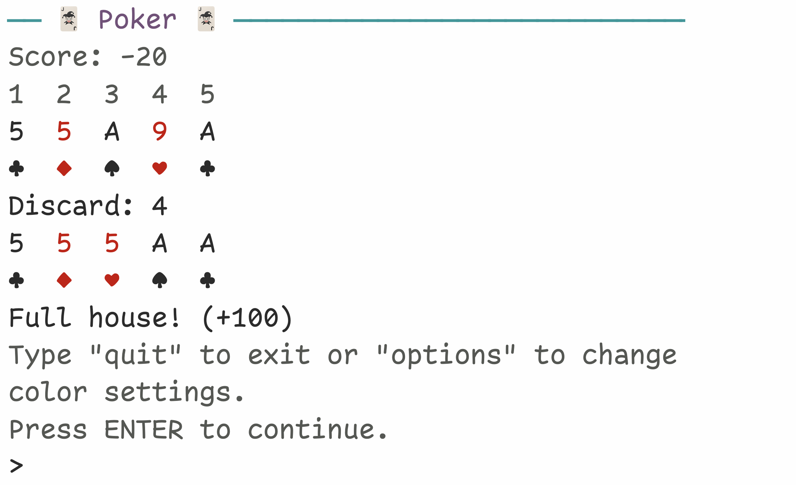

<!-- README.md is generated from README.Rmd. Please edit that file -->

```{r, include = FALSE}
knitr::opts_chunk$set(
  collapse = TRUE,
  comment = "#>",
  fig.path = "man/figures/README-",
  out.width = "100%"
)
```

# player 

<!-- badges: start -->
`r badger::badge_cran_release(color = "brightgreen")`
`r badger::badge_runiverse()`
`r badger::badge_github_version(color = "brightgreen")`
`r badger::badge_lifecycle("stable")`
`r badger::badge_license("MIT", color = "blueviolet")`
<!-- badges: end -->

## Installation

You can install the release version of **player** from [CRAN](https://cran.r-project.org/package=player) with:
``` r
install.packages("player")
```

Or you can install the development version from [R-universe](https://rossellhayes.r-universe.dev/player) with:
``` r
install.packages("player", repos = c("https://rossellhayes.r-universe.dev", "https://cloud.r-project.org"))
```

or from [GitHub](https://github.com/rossellhayes/player) with:
``` r
# install.packages("pak")
pak::pkg_install("rossellhayes/player")
```

## Games

**player** includes `r length(player:::game_list)` games that you can player entirely within the R console:

```{r echo = FALSE, results = "asis"}
cat(paste("*", names(player:::game_list), collapse = "\n"))
```

Install the package and run `player::play()` to get playing!

## Gallery

### Hangman


### Poker



### 2048


---

Hex sticker image by Flavia Rossell Hayes.
